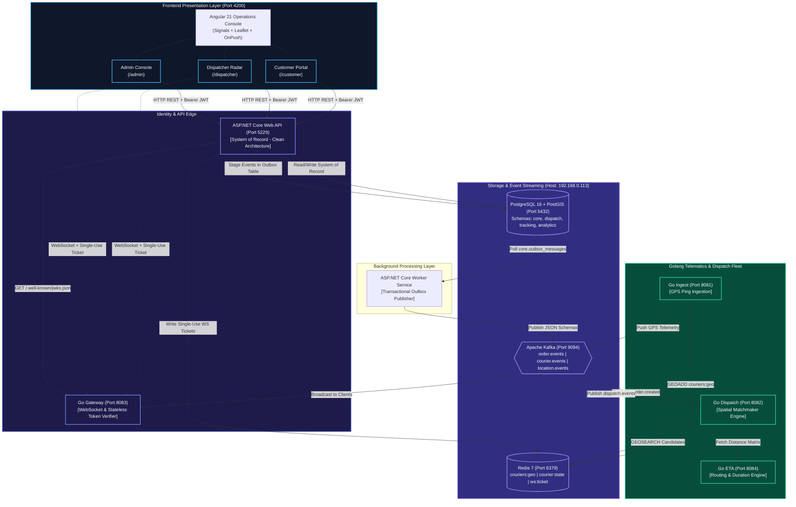
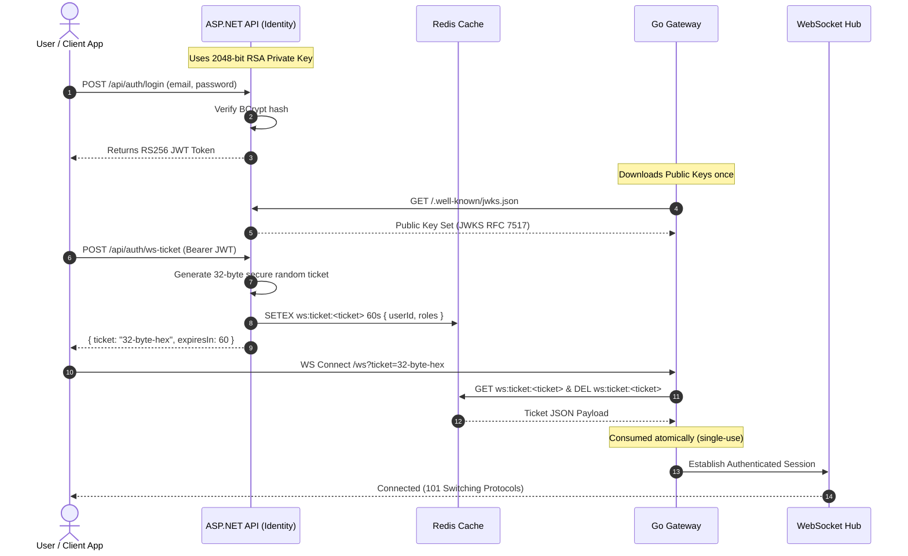

# Distributed Logistics & Real-Time Fleet Dispatch Platform
## System Architecture & Comprehensive Technical Reference Manual

---

## 1. Executive Summary & Architectural Overview

The **Distributed Logistics & Real-Time Fleet Dispatch Platform** is an enterprise-scale, event-driven distributed system engineered for mission-critical courier routing, dispatch automation, and real-time spatial fleet telematics.

The platform employs a **polyglot microservices architecture** that balances strong domain consistency with ultra-low-latency real-time stream processing:

- **ASP.NET Core 10 (Clean Architecture)**: Serves as the authoritative **System of Record (SoR)**. It manages relational consistency, user identity, cryptographic token signing (RS256), multi-stop order lifecycles, courier onboarding state, and transactional outbox staging.
- **Golang 1.23 Microservices**: Handle high-throughput, low-latency workloads including real-time GPS telemetry ingestion, Redis spatial matchmaking (`GEOSEARCH`), routing/ETA matrix estimations, and stateless WebSocket fan-out.
- **Angular 21 (Signals & Standalone)**: Provides a high-performance, dark-mode tactical operations console with Leaflet map visualization, 250ms throttled radar rendering, and reactive signal workflows.
- **Storage & Messaging Backbone**:
  - **PostgreSQL 16 + PostGIS**: Multi-schema spatial relational database (`core`, `dispatch`, `tracking`, `analytics`).
  - **Redis 7.x**: In-memory spatial index (`couriers:geo`), live courier state hashes, and single-use WebSocket tickets.
  - **Apache Kafka**: Scalable event streaming backbone for cross-service asynchronous event propagation.



---

## 2. Infrastructure & Storage Topology

### 2.1 PostgreSQL 16 + PostGIS Multi-Schema Isolation
All persistent data resides on host `192.168.0.113:5432/appdb`. Strict logical separation ensures microservice domain independence without cross-schema foreign keys.

| Schema Name | Service Owner | Primary Tables | Responsibility |
|---|---|---|---|
| **`core`** | `services/dotnet-api` | `users`, `roles`, `user_roles`, `couriers`, `vehicles`, `orders`, `order_stops`, `order_status_history`, `idempotency_keys`, `outbox_messages`, `refresh_tokens` | Authoritative system of record for accounts, orders, vehicles, and transaction staging. |
| **`dispatch`** | `services/go-dispatch` | `dispatch_runs`, `courier_offers`, `assignments` | Short-lived dispatch matching transactions, offer queues, lockouts, and assignments. |
| **`tracking`** | `services/go-ingest` | `courier_pings`, `order_breadcrumbs` | High-volume time-series GPS pings with PostGIS spatial geometry indexing. |
| **`analytics`** | Analytics Consumers | `daily_metrics`, `courier_performance` | Rollups, delivery duration distributions, and historical KPIs. |

> [!IMPORTANT]
> **Spatial Geometry Standard**:
> All geospatial columns use PostGIS `GEOMETRY(Point, 4326)` or `GEOGRAPHY(Point, 4326)`.
> In C# (.NET NetTopologySuite), spatial points are instantiated as `new Point(longitude, latitude) { SRID = 4326 }`.
> In Go and Leaflet, coordinates are formatted as `(Longitude, Latitude)` for calculations and `[Latitude, Longitude]` for map rendering.

### 2.2 Redis 7 Data Structures
Redis (`192.168.0.113:6379`) handles ephemeral real-time state:
1. **Spatial Geospatial Sorted Set (`couriers:geo`)**:
   - Updated via `GEOADD couriers:geo <longitude> <latitude> <courier_id>` by `go-ingest` and ASP.NET.
   - Queried via `GEOSEARCH couriers:geo FROMLONLAT <lon> <lat> BYRADIUS <radius_km> KM ASC WITHDIST WITHCOORD`.
2. **Courier State Hash (`courier:<id>:state`)**:
   - Stores fast runtime metadata: `status` (`Available`, `Busy`, `Offline`), `battery_level`, `last_ping`, `active_order_id`.
3. **Single-Use WebSocket Tickets (`ws:ticket:<ticket>`)**:
   - Ephemeral key storing serialized user identity with a strict 60-second TTL.
   - Atomically consumed (`DEL`) upon handshake.

### 2.3 Kafka Event Streams
Kafka (`192.168.0.113:9094`) coordinates inter-service event communication:
- **`order.events`**: Emits `order.created`, `order.cancelled`, and `order.status.changed`.
- **`courier.events`**: Emits `courier.registered`, `courier.status.changed`, and `courier.approved`.
- **`dispatch.events`**: Emits `dispatch.offer.created`, `dispatch.offer.accepted`, `dispatch.offer.rejected`.
- **`location.events`**: High-frequency stream of normalized courier GPS coordinates.

---

## 3. Cryptography & Security Model

The security model implements zero-trust inter-service verification:



1. **RS256 JWT Signing & RFC 7517 JWKS**:
   - ASP.NET maintains a secure 2048-bit RSA key pair (`RsaKeyService.cs`).
   - Access tokens are signed using `RS256` and contain claims for `sub`, `email`, `name`, and `role`.
   - The public key is exposed at `/.well-known/jwks.json` and `/api/auth/jwks`.
   - Go services parse and verify signatures locally without calling database infrastructure.
2. **Single-Use WebSocket Tickets**:
   - WebSockets avoid passing raw Authorization headers in browser query parameters.
   - Clients request an ephemeral ticket via `POST /api/auth/ws-ticket`, passing their Bearer token.
   - The ticket expires in 60 seconds and is deleted upon first read, preventing replay attacks.
3. **Role-Based Access Control**:
   - `Admin`: Full oversight, approval of couriers, configuration.
   - `Dispatcher`: Live fleet radar access, manual dispatch overrides, order assignment.
   - `Courier`: Self-shift management (`Available`, `Busy`, `Offline`), order pickup, delivery confirmations.
   - `Customer`: Order placement, stop management, live tracking.

---

## 4. Backend Service: ASP.NET Core Web API (`services/dotnet-api`)

Built in .NET 10 following **Clean Architecture**:
```
services/dotnet-api/
├── Application/
│   ├── Common/Exceptions/     # Application domain exceptions
│   ├── DTOs/                  # Request / Response transfer objects
│   └── Interfaces/            # Service and Repository contracts
├── Domain/
│   └── Entities/              # Core EF Core domain entities
├── Infrastructure/
│   ├── Data/                  # DbContext, migrations, and initializer
│   ├── Filters/               # Idempotency and validation filters
│   ├── Middleware/            # Correlation ID and ProblemDetails handlers
│   ├── Repositories/          # Concrete PostgreSQL/PostGIS data access
│   ├── Security/              # RSA, JWT, BCrypt, and Ticket services
│   └── Services/              # Core business orchestration services
└── Controllers/               # REST API HTTP Endpoints
```

### 4.1 Controllers & Endpoints Reference

#### `Controllers/AuthController.cs`
- `POST /api/auth/register`
  - **Function**: `RegisterAsync([FromBody] RegisterRequest request)`
  - **Logic**: Validates uniqueness of email/phone, hashes password using BCrypt, creates `User` and `Customer`/`Courier` records. Courier starts in `PendingApproval` status.
- `POST /api/auth/login`
  - **Function**: `LoginAsync([FromBody] LoginRequest request)`
  - **Logic**: Validates credentials with BCrypt; issues RS256 JWT and rolling refresh token.
- `POST /api/auth/refresh`
  - **Function**: `RefreshTokenAsync([FromBody] RefreshTokenRequest request)`
  - **Logic**: Rotates refresh tokens and issues fresh access token.
- `POST /api/auth/revoke`
  - **Function**: `RevokeTokenAsync([FromBody] RevokeTokenRequest request)`
  - **Logic**: Revokes user refresh token.
- `GET /api/auth/me`
  - **Function**: `GetMeAsync()`
  - **Logic**: Returns profile, roles, and status of current authenticated user.
- `GET /api/auth/jwks` & `GET /.well-known/jwks.json`
  - **Function**: `GetJwks()`
  - **Logic**: Returns RFC 7517 compliant JWKS JSON containing RSA modulus `n` and exponent `e`.
- `POST /api/auth/ws-ticket`
  - **Function**: `GenerateWebSocketTicketAsync()`
  - **Logic**: Creates 32-byte single-use token in Redis with 60-second TTL.

#### `Controllers/OrdersController.cs`
- `POST /api/orders`
  - **Function**: `CreateOrderAsync([FromBody] CreateOrderRequest request)`
  - **Filter**: `[RequireIdempotencyKey]`
  - **Logic**: Idempotently generates order, builds NetTopologySuite Point geometries for pickup/dropoff stops, writes status history, and stages `order.created` in `core.outbox_messages`.
- `GET /api/orders/{id}`
  - **Function**: `GetOrderByIdAsync(Guid id)`
  - **Logic**: Returns order aggregate including stops, assignments, and audit trail.
- `GET /api/orders`
  - **Function**: `GetOrdersAsync([FromQuery] OrderFilter filter)`
  - **Logic**: Returns paginated orders filtered by status, date range, or courier/customer IDs.
- `POST /api/orders/{id}/cancel`
  - **Function**: `CancelOrderAsync(Guid id, [FromBody] CancelOrderRequest request)`
  - **Logic**: Verifies cancellable status, updates status to `Cancelled`, and writes `order.cancelled` outbox event.
- `POST /api/orders/{id}/pickup`
  - **Function**: `PickupOrderAsync(Guid id)`
  - **Logic**: Transitions status from `Assigned` to `InTransit`, records timestamp.
- `POST /api/orders/{id}/deliver`
  - **Function**: `DeliverOrderAsync(Guid id)`
  - **Logic**: Transitions status from `InTransit` to `Delivered`, marks completion.

#### `Controllers/CouriersController.cs`
- `GET /api/couriers`
  - **Function**: `GetCouriersAsync([FromQuery] string? status)`
  - **Logic**: Returns couriers filtered by status (`Available`, `Busy`, `Offline`).
- `GET /api/couriers/{id}`
  - **Function**: `GetCourierByIdAsync(Guid id)`
  - **Logic**: Returns courier profile, current vehicle, and current active order.
- `GET /api/couriers/me`
  - **Function**: `GetMyCourierProfileAsync()`
  - **Logic**: Returns courier profile for authenticated courier user.
- `PUT /api/couriers/{id}/status`
  - **Function**: `UpdateCourierStatusAsync(Guid id, [FromBody] UpdateCourierStatusRequest request)`
  - **Logic**: Enforces business rule: **a courier cannot go `Offline` if they have active assigned orders** (`409 Conflict`). Updates Redis `couriers:geo` and emits `courier.status.changed`.

#### `Controllers/AdminController.cs`
- `GET /api/admin/couriers/pending`
  - **Function**: `GetPendingCouriersAsync()`
  - **Logic**: Lists courier applications in `PendingApproval` status.
- `POST /api/admin/couriers/{id}/approve`
  - **Function**: `ApproveCourierAsync(Guid id)`
  - **Logic**: Transitions courier status to `Active`, allowing them to begin receiving orders.

### 4.2 Repositories & Services Implementation
- **`Infrastructure/Services/OrderService.cs`**:
  - Implements atomic creation and state machine transitions.
  - Formats payload according to `contracts/events/order.created.v1.json`.
  - Atomically saves order, stops, history, and outbox event inside a single transaction.
- **`Infrastructure/Services/CourierService.cs`**:
  - Validates valid status state transitions.
  - Updates Redis sorted set `couriers:geo` and hash `courier:<id>:state`.
- **`Infrastructure/Filters/IdempotencyFilter.cs`**:
  - Computes SHA-256 hash of incoming request body.
  - Checks `core.idempotency_keys` table. If cached, short-circuits execution and returns stored response with `X-Idempotency-Cache: HIT`.
  - If new, records key, runs request, and caches response with `X-Idempotency-Cache: MISS`.
- **`Infrastructure/Security/RsaKeyService.cs`**:
  - Generates 2048-bit RSA keys and exports public keys as RFC 7517 JWKS.
- **`Infrastructure/Middleware/GlobalExceptionHandler.cs`**:
  - Converts unhandled exceptions into RFC 7807 `ProblemDetails` payloads.

---

## 5. Golang Microservices Fleet

### 5.1 Location Ingest Service (`services/go-ingest`) — Port 8081
- **Role**: High-speed, non-blocking GPS telemetry ingestion.
- **Key Modules**:
  - `main.go`: Initializes HTTP server, health checks (`/health`, `/ready`), graceful shutdown.
  - `internal/config/config.go`: Loads `.env` configuration (Database, Redis, Kafka, Port).
  - `internal/domain/models.go`: Defines `LocationPing` struct (`CourierID`, `Latitude`, `Longitude`, `Speed`, `Heading`, `Timestamp`).
- **Telemetry Processing**:
  - Ingests GPS telemetry payloads.
  - Writes coordinates to Redis spatial index: `GEOADD couriers:geo <lon> <lat> <courier_id>`.
  - Publishes `location.events` messages to Kafka for stream processing.

### 5.2 Dispatch & Matching Engine (`services/go-dispatch`) — Port 8082
- **Role**: Automated courier assignment state machine.
- **Key Modules**:
  - `main.go`: Initializes server router and lifecycle management.
  - `internal/domain/events.go`: Go struct definitions for `OrderCreatedEvent`, `OrderCancelledEvent`, `OrderStatusChangedEvent`, `CourierStatusChangedEvent`.
  - `internal/domain/models.go`: Core domain structs for `DispatchRun`, `CourierOffer`, `Assignment`.
- **Matching Pipeline**:
  - Listens to `order.events` (`order.created`).
  - Calls Redis `GEOSEARCH couriers:geo` to discover nearby couriers with status `Available`.
  - Queries `go-eta` to calculate travel duration.
  - Dispatches sequential courier offers with 30-second timeout locks.
  - Publishes `dispatch.events` to Kafka.

### 5.3 Realtime WebSocket Gateway (`services/go-gateway`) — Port 8083
- **Role**: High-concurrency WebSocket server pushing live fleet positions and order updates to Angular clients.
- **Key Modules**:
  - `main.go`: WebSocket entry point (`/ws`), router initialization, graceful shutdown.
  - `internal/auth/validator.go`: Parses ASP.NET JWKS, validates RS256 JWT tokens, and validates/consumes single-use Redis WebSocket tickets.
  - `internal/auth/validator_test.go`: Unit tests for token parsing, expired tokens, invalid signatures, and missing keys.
  - `internal/auth/ticket_test.go`: Integration tests verifying single-use Redis ticket redemption and replay attack rejection.

### 5.4 Routing & ETA Calculation Engine (`services/go-eta`) — Port 8084
- **Role**: Distance matrix estimation and route duration calculations.
- **Key Modules**:
  - `main.go`: HTTP endpoints (`/api/v1/eta`, `/health`, `/ready`).
  - `internal/domain/models.go`: Request/Response structs for waypoint coordinates, estimated distance (meters), and duration (seconds).

---

## 6. Frontend Operations Console: Angular 21 (`web/angular`)

Built in Angular 21 with **Standalone Components**, **Angular Signals**, and `ChangeDetectionStrategy.OnPush`.

### 6.1 State Management & Architecture
```
web/angular/src/app/
├── core/
│   ├── guards/          # authGuard, roleGuard
│   ├── interceptors/    # authInterceptor (JWT & X-Correlation-Id)
│   ├── models/          # TypeScript interfaces matching OpenAPI
│   └── services/        # AuthService, OrderService, CourierService, WebSocketService
├── features/
│   ├── admin/           # AdminPanelComponent
│   ├── auth/            # LoginComponent, RegisterComponent
│   ├── customer/        # CustomerPortalComponent
│   └── dispatcher/      # DispatcherConsoleComponent
└── shared/
    └── components/      # LiveMapComponent, NavbarComponent, StatusBadgeComponent
```

### 6.2 Key Services & Components
- **`core/services/auth.service.ts`**:
  - Manages authenticated session using signals: `currentUser = signal<User | null>(null)`, `isAuthenticated = computed(...)`.
  - Stores JWT and refresh token in `localStorage`.
  - Handles login, registration, token refresh, and logout.
- **`core/services/websocket.service.ts`**:
  - Requests single-use ticket from `POST /api/auth/ws-ticket`.
  - Connects to `ws://localhost:8083/ws?ticket=<ticket>`.
  - Throttles incoming location updates to **250ms batching windows** to prevent browser render thrashing.
  - Automatically reconnects with exponential backoff on disconnect.
- **`shared/components/map/live-map.component.ts`**:
  - Renders interactive Leaflet map using dark tile layers (`CartoDB.DarkMatter`).
  - Renders custom pulsating SVG markers for active couriers.
  - Draws order paths, pickup pins, and dropoff markers.
- **`features/customer/customer-portal.component.ts` (`/customer`)**:
  - Multi-stop order creation form with automatic UUID `Idempotency-Key` generation.
  - Live order tracking panel with real-time status progression pills.
- **`features/dispatcher/dispatcher-console.component.ts` (`/dispatcher`)**:
  - Tactical fleet radar dashboard.
  - Courier availability toggles (`Available` $\leftrightarrow$ `Offline`).
  - Active orders dispatch queue and manual courier assignment.
- **`features/admin/admin-panel.component.ts` (`/admin`)**:
  - Onboarding table for couriers in `PendingApproval` status.
  - One-click approval action calling `POST /api/admin/couriers/{id}/approve`.

---

## 7. Unified Orchestration & Automation Scripts

### 7.1 `start-all.ps1` — Unified Service Launcher
A complete PowerShell automation script that spins up all 7 platform services concurrently.

#### Features & Logic:
1. **Network IP Auto-Detection**:
   - Queries `Get-NetIPConfiguration` and `Get-NetIPAddress`.
   - Identifies the host's actual LAN IP address (e.g., `192.168.0.104`) and prints both `localhost` and LAN endpoints.
2. **Toolchain Verification**:
   - Checks presence and versions of `dotnet`, `go`, `node`, and `npm`.
3. **Infrastructure Accessibility Probing**:
   - Probes PostgreSQL (`192.168.0.113:5432`), Redis (`192.168.0.113:6379`), and Kafka (`192.168.0.113:9094`) before starting application services.
4. **Environment Initialization**:
   - Copies `.env.example` to `.env` if missing.
5. **Process Lifecycle & PID Tracking**:
   - Starts each process with redirected logs into `logs/<service>.log`.
   - Saves active PIDs and service names into `.services.json` for deterministic tracking.
6. **Health Check Probing**:
   - Polls `/health` endpoints on all services with configurable timeout (`TimeoutSeconds = 30`).
7. **Interactive Dashboard**:
   - Displays a live color-coded status table showing service name, PID, local URL, LAN URL, and HTTP status code.

#### Execution Parameters:
```powershell
# Default: Start all services in background and monitor
.\start-all.ps1

# Open each service in its own separate command window for live log viewing
.\start-all.ps1 -Windowed

# Run backend services only (skip Angular UI)
.\start-all.ps1 -NoFrontend

# Detach immediately after starting
.\start-all.ps1 -Detach
```

### 7.2 `stop-all.ps1` — Graceful Process Stopper
Safely tears down all running platform services.

#### Features & Logic:
1. Reads `.services.json` to find tracked process IDs.
2. Executes `taskkill /F /T /PID <pid>` to terminate entire process trees (ensuring child `node`, `dotnet`, and `go` processes are terminated).
3. Inspects ports `4200`, `5229`, `8081`, `8082`, `8083`, `8084` via `Get-NetTCPConnection` to ensure no orphaned processes remain bound to platform ports.
4. Cleans up `.services.json` session files.

---

## 8. Automated Test Suite & Quality Verification

The test suite covers unit and integration validation across both runtimes:

```
Total Automated Tests: 32 / 32 Passed (100%)
- .NET xUnit Tests:  15 Passed
- Go Unit/Integration: 17 Passed
```

### 8.1 .NET xUnit Tests (`tests/LogisticServer.Tests/`)
- `AuthIntegrationTests.cs`:
  - `Register_ValidCustomer_ReturnsSuccessAndJwtToken`
  - `Register_DuplicateEmail_ReturnsConflict`
  - `Login_ValidCredentials_ReturnsJwtAndRefreshToken`
  - `Login_InvalidPassword_ReturnsUnauthorized`
  - `WebSocketTicket_ReturnsSingleUseTokenWithExpiry`
- `InteropTests.cs`:
  - `JwksEndpoint_ReturnsValidRsaParameters`: Confirms `n` and `e` are present, base64url-encoded, and parseable into standard RSA keys.
  - `JwtToken_SignedWithRsa_CanBeVerifiedWithJwksPublicKey`: Creates a token in ASP.NET and validates signature using exported public JWKS.
  - `WebSocketTicket_StoredInRedis_CanBeReadAndDeleted`: Simulates Go Gateway reading and consuming ticket from Redis.
  - `CourierLocation_CanBeAddedToRedisGeo_AndQueried`: Simulates ASP.NET writing coordinates and querying them via `GeoSearch`.

### 8.2 Go Tests (`services/go-gateway` & `services/go-dispatch`)
- `services/go-gateway/internal/auth/validator_test.go`:
  - `TestValidateJWT_ValidToken`: Verifies ASP.NET RS256 token against JWKS.
  - `TestValidateJWT_ExpiredToken`: Rejects expired token.
  - `TestValidateJWT_WrongKey`: Rejects tokens signed by unauthorized key pairs.
  - `TestValidateJWT_MissingKey`: Handles missing key IDs.
- `services/go-gateway/internal/auth/ticket_test.go`:
  - `TestValidateAndConsumeTicket_Success`: Consumes Redis ticket and verifies claims.
  - `TestValidateAndConsumeTicket_ReplayRejected`: Rejects duplicate ticket use.
- `services/go-dispatch/internal/domain/events_test.go`:
  - Deserializes ASP.NET outbox JSON payloads into Go domain event structs.
- `services/go-dispatch/internal/domain/geo_interop_test.go`:
  - Reads Redis `couriers:geo` set created by ASP.NET.

---

## 9. API & Service Port Matrix

| Service | Protocol | Local URL | LAN URL | Owner / Tech |
|---|---|---|---|---|
| **Angular Web Console** | HTTP | [http://localhost:4200](http://localhost:4200) | `http://192.168.0.104:4200` | Angular 21 (Signals) |
| **ASP.NET Core Web API** | HTTP | [http://localhost:5229](http://localhost:5229) | `http://192.168.0.104:5229` | .NET 10 (Clean Architecture) |
| **Swagger UI Documentation** | HTTP | [http://localhost:5229/swagger](http://localhost:5229/swagger) | `http://192.168.0.104:5229/swagger` | OpenAPI 3.1 |
| **Go Location Ingest** | HTTP | `http://localhost:8081` | `http://192.168.0.104:8081` | Go 1.23 |
| **Go Dispatch Engine** | HTTP | `http://localhost:8082` | `http://192.168.0.104:8082` | Go 1.23 |
| **Go Realtime Gateway** | HTTP / WS | `http://localhost:8083` | `http://192.168.0.104:8083` | Go 1.23 (WebSockets) |
| **Go ETA Calculation** | HTTP | `http://localhost:8084` | `http://192.168.0.104:8084` | Go 1.23 |
| **PostgreSQL 16 + PostGIS** | TCP | `localhost:5432` | `192.168.0.113:5432` | PostgreSQL + PostGIS |
| **Redis 7.x** | TCP | `localhost:6379` | `192.168.0.113:6379` | Redis In-Memory / Spatial |
| **Apache Kafka** | TCP | `localhost:9094` | `192.168.0.113:9094` | Kafka Cluster |

