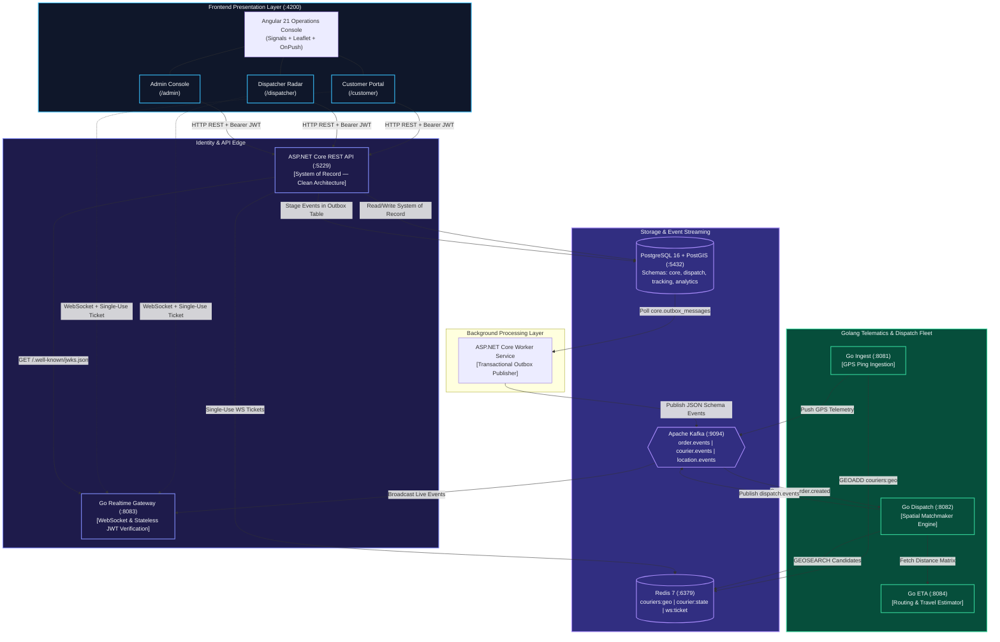

# 🚀 Distributed Logistics & Real-Time Fleet Dispatch Platform

[](https://dotnet.microsoft.com/)
[](https://golang.org/)
[](https://angular.dev/)
[](https://www.postgresql.org/)
[](https://redis.io/)
[](https://kafka.apache.org/)
[](https://prometheus.io/)
[](https://grafana.com/)

An enterprise-grade, event-driven distributed system designed for high-concurrency order management, spatial courier telematics, real-time dispatch matchmaking, and live GPS fleet tracking.

Built with a **polyglot microservices architecture** that decouples transactional business logic from ultra-low-latency real-time ingestion paths.

---

## 📑 Table of Contents

- [Architectural Overview](#-architectural-overview)
- [System Architecture Diagram](#-system-architecture-diagram)
- [Service Directory & Responsibilities](#-service-directory--responsibilities)
- [Key Architectural Patterns](#-key-architectural-patterns)
  - [Polyglot Separation of Concerns](#1-polyglot-separation-of-concerns)
  - [Transactional Outbox Pattern](#2-transactional-outbox-pattern)
  - [Zero-Trust Asymmetric Authentication](#3-zero-trust-asymmetric-authentication)
  - [Spatial Matchmaking Engine](#4-spatial-matchmaking-engine)
  - [Full-Stack Observability](#5-full-stack-observability)
- [Getting Started](#-getting-started)
  - [Prerequisites](#prerequisites)
  - [Local Environment Setup](#local-environment-setup)
  - [One-Click Platform Runner](#one-click-platform-runner)
- [Testing & Quality Assurance](#-testing--quality-assurance)
  - [Built-In Load & Stress Testing Engine](#built-in-load--stress-testing-engine)
  - [Smoke Testing](#smoke-testing)
  - [Stress & Capacity Testing](#stress--capacity-testing)
- [Observability & Monitoring](#-observability--monitoring)
  - [Prometheus Endpoints](#prometheus-endpoints)
  - [Grafana Dashboard Setup](#grafana-dashboard-setup)
- [API & Core Endpoints](#-api--core-endpoints)
- [Repository Structure](#-repository-structure)
- [License & Contribution](#-license--contribution)

---

## 🏛 Architectural Overview

The platform addresses two distinct throughput profiles:

1. **System of Record (SoR) — ASP.NET Core 10 (Clean Architecture)**:
   Authoritative owner of users, cryptographic token signing (RS256), customer accounts, courier profiles, vehicle fleets, multi-stop order state machines, idempotency caching, and transactional outbox staging.
2. **Hot Telemetry & Dispatch Path — Golang 1.26 Microservices**:
   High-throughput, low-latency concurrent microservices handling GPS ping ingestion, Redis spatial matchmaking (`GEOSEARCH`), route ETA estimations, and stateless WebSocket fan-out.
3. **Tactical Operations Console — Angular 21 (Standalone + Signals)**:
   A dark-mode tactical dashboard featuring reactive Signals, OnPush change detection, Leaflet maps, and a 250ms throttled radar view.

---

## 📊 System Architecture Diagram



---

## 📦 Service Directory & Responsibilities

| Service | Technology | Port | Primary Responsibility | Metrics Endpoint |
|---|---|---|---|---|
| **`dotnet-api`** | ASP.NET Core 10 | `5229` | System of record, RS256 Auth, Orders, Couriers, Idempotency | `/metrics` & `/api/metrics` |
| **`dotnet-worker`** | ASP.NET Core 10 | Background | Transactional outbox polling, Kafka event publishing | Console / Logs |
| **`go-ingest`** | Go 1.26 | `8081` | Real-time GPS coordinate ingestion, Redis `GEOADD` | `/metrics` & `/ingest/metrics` |
| **`go-dispatch`** | Go 1.26 | `8082` | Automated courier assignment, spatial radius search | `/metrics` & `/dispatch/metrics` |
| **`go-gateway`** | Go 1.26 | `8083` | Concurrency WebSocket server, single-use ticket auth | `/metrics` & `/ws/metrics` |
| **`go-eta`** | Go 1.26 | `8084` | Routing calculation, distance matrix & ETA estimation | `/metrics` & `/eta/metrics` |
| **`angular-web`** | Angular 21 | `4200` | Tactical operations dashboard, customer portal, fleet radar | Web Console |

---

## ⚡ Key Architectural Patterns

### 1. Polyglot Separation of Concerns
- **Domain Consistency**: ASP.NET Core handles business boundaries, ACID transactions, and complex entities with Entity Framework Core and PostGIS geometries (`NetTopologySuite`).
- **High-Throughput Hot Path**: Go microservices ingest thousands of GPS pings per second and handle high-volume WebSockets with low memory footprints and bounded goroutine pools.

### 2. Transactional Outbox Pattern
State mutations and event notifications commit in the **exact same database transaction**:
1. When an order or courier is modified, the API writes both domain rows and an event to `core.outbox_messages`.
2. `dotnet-worker` sweeps unpublished events using row-level locking (`FOR UPDATE SKIP LOCKED`).
3. Events are published to Apache Kafka with zero dual-write race conditions or ghost events.

### 3. Zero-Trust Asymmetric Authentication
- `dotnet-api` issues **RS256 asymmetric JWTs**.
- Exposes RFC 7517 public keys via `/.well-known/jwks.json` and `/api/auth/jwks`.
- Go microservices validate JWT signatures completely offline using cached JWKS public keys without HTTP chatter back to the API.
- WebSockets authenticate via **cryptographically generated single-use tickets** stored in Redis with a 60-second TTL.

### 4. Spatial Matchmaking Engine
- Courier positions update every 3–5 seconds directly into Redis `GEOADD couriers:geo`.
- When an order requires assignment, `go-dispatch` issues `GEOSEARCH` within an expanding radius (3km &rarr; 5km &rarr; 10km) to find online, available couriers.
- Candidate scores evaluate Haversine distance, courier rating, and current vehicle capacity.

### 5. Full-Stack Observability
- All backends implement native **Prometheus instrumentation** exposing HTTP request rates, latency histograms, error rates, garbage collection, and runtime thread/goroutine metrics.
- Tuned Kestrel socket queues (up to 30,000 concurrent connections) and bounded Npgsql connection pooling (max 80) prevent connection starvation under intense spikes.

---

## 🛠 Getting Started

### Prerequisites

Ensure the following runtimes and tools are installed:
- [.NET 10 SDK](https://dotnet.microsoft.com/download/dotnet/10.0)
- [Go 1.23+ / 1.26](https://golang.org/dl/)
- [Node.js 22 LTS](https://nodejs.org/) & `npm`
- [Docker & Docker Compose](https://www.docker.com/) (running PostgreSQL + PostGIS, Redis, Kafka)

### Local Environment Setup

1. **Clone the repository:**
   ```bash
   git clone https://github.com/FahadAkash/LogisticSystem.git
   cd LogisticSystem
   ```

2. **Configure environment settings:**
   Copy the example environment file and customize your database and Redis hosts:
   ```bash
   cp .env.example .env
   ```

3. **Initialize Database Schemas:**
   Run the database migration initializer:
   ```powershell
   dotnet run --project services/dotnet-api/LogisticServer.csproj -- --migrate
   ```

### One-Click Platform Runner

We provide cross-platform runner scripts that discover your network interfaces, start all 7 services concurrently, and display a live health status dashboard.

#### Windows (PowerShell)
```powershell
# Interactive mode with status watcher
.\start-all.ps1

# Or run in background detached mode
.\start-all.ps1 -Detach

# Open each service in its own dedicated terminal window
.\start-all.ps1 -Windowed
```

To stop all background services at any time:
```powershell
.\stop-all.ps1
```

#### Linux / macOS (Bash)
```bash
chmod +x start-all.sh stop-all.sh
./start-all.sh
```

---

## 🧪 Testing & Quality Assurance

### Built-In Load & Stress Testing Engine

The repository includes a dedicated high-performance load testing engine located in [`tools/load-tester`](tools/load-tester). Built in Go, it exercises all platform paths without requiring external heavy test suites.

```bash
cd tools/load-tester
go build -o loadtest.exe ./cmd/loadtest
```

### Smoke Testing
Verify that all 21 critical microservice endpoints, JWKS discovery, PostGIS queries, and WebSocket handshakes are fully operational:

```powershell
# Test local development instance
.\loadtest.exe -target "http://localhost:5229" -mode smoke

# Test remote LAN server (auto-resolves Nginx reverse proxy routes)
.\loadtest.exe -target "http://192.168.0.113" -mode smoke
```

### Stress & Capacity Testing
Simulates up to 1,500+ stepped concurrent virtual users (VUs) with customer journeys, GPS telematics floods, and concurrent WebSocket channels:

```powershell
.\loadtest.exe -target "http://192.168.0.113" -mode stress -max-users 1500 -step-users 100
```

> [!TIP]
> The load tester automatically generates:
> - 📄 **`load_test_report.html`**: Interactive Chart.js report with latency percentiles, error breakdowns, and concurrency steps.
> - 📝 **`STRESS_TEST_REPORT.md`**: Executive markdown summary with capacity diagnoses.

---

## 📈 Observability & Monitoring

### Prometheus Endpoints

Every service exposes standard Prometheus-compatible telemetry:

| Service | Target URL | Scraped Metrics |
|---|---|---|
| **ASP.NET API** | `http://localhost:5229/metrics` | HTTP duration histograms, request counts, GC, ThreadPool |
| **Go Ingest** | `http://localhost:8081/metrics` | GPS ingestion throughput, Redis latencies, Goroutines |
| **Go Dispatch** | `http://localhost:8082/metrics` | Matchmaking duration, offer counters, queue depth |
| **Go Gateway** | `http://localhost:8083/metrics` | Active WebSocket connections, message fan-out rate |
| **Go ETA** | `http://localhost:8084/metrics` | Route calculation duration, cache hits |

### Grafana Dashboard Setup

When accessing Grafana (e.g. `http://<server-ip>/grafana/`):
1. **Prometheus Data Source**: Point to your Prometheus instance (`http://prometheus:9090` or `http://localhost:9090`).
2. **Recommended Dashboards to Import**:
   - **Linux Host Monitoring**: Import Dashboard ID **`1860`** (Node Exporter Full) for CPU, Memory, Disk, and Network telemetry.
   - **Docker Containers**: Import Dashboard ID **`14282`** or **`893`** (cAdvisor) for per-container CPU & RAM limits.
   - **ASP.NET Core Performance**: Import Dashboard ID **`10915`** for live request rates and P95/P99 latency trends.

---

## 🔌 API & Core Endpoints

### Default Credentials (Seed Data)
- **Admin**: `admin@logistic.local` / `Admin1234!`
- **Customer**: `customer@logistic.local` / `Customer1234!`
- **Courier**: `courier@logistic.local` / `Courier1234!`

### Key API Routes

#### 🔐 Authentication & Identity
- `POST /api/auth/register` — Register a customer or courier account
- `POST /api/auth/login` — Login with credentials, receive RS256 JWT
- `POST /api/auth/refresh` — Rotate refresh tokens
- `GET  /api/auth/me` — Retrieve authenticated user profile
- `POST /api/auth/ws-ticket` — Generate single-use ticket for WebSocket connection
- `GET  /.well-known/jwks.json` — Public JWKS key set for offline validation

#### 📦 Orders & Dispatch
- `POST /api/orders` — Create multi-stop order (`Idempotency-Key` required)
- `GET  /api/orders` — Paginated order feed
- `GET  /api/orders/{id}` — Order details with PostGIS pickup/delivery stops
- `POST /api/orders/{id}/cancel` — Cancel an order aggregate

#### 🚚 Couriers & Fleet Telematics
- `GET  /api/couriers` — List courier radar feed
- `POST /api/couriers/status` — Set courier online/offline status
- `POST /api/v1/location` *(or `/ingest/api/v1/location`)* — High-frequency GPS ping (`courierId`, `lat`, `lon`)
- `GET  /ws?ticket={ticket}` — Real-time tracking WebSocket channel

---

## 📂 Repository Structure

```plaintext
LogisticSystem/
├── contracts/                  # Single source of truth for event schemas & OpenAPI
│   ├── events/                 # JSON Schemas for Kafka event envelopes
│   ├── openapi/                # OpenAPI 3.0 specification
│   └── websocket/              # WebSocket ticket and payload contracts
├── infra/                      # Infrastructure & database configurations
│   └── migrations/             # Multi-schema SQL migrations (PostgreSQL + PostGIS)
├── services/                   # Application microservices
│   ├── dotnet-api/             # ASP.NET Core REST API & Identity (Clean Architecture)
│   ├── dotnet-worker/          # ASP.NET Core Transactional Outbox Worker
│   ├── go-ingest/              # High-throughput GPS Ping Ingest Service
│   ├── go-dispatch/            # Spatial Matchmaking & Courier Assignment Engine
│   ├── go-gateway/             # WebSocket Server & Event Fan-Out Hub
│   └── go-eta/                 # Route Distance Matrix & ETA Engine
├── tests/                      # Automated test projects
│   └── LogisticServer.Tests/   # Integration & interoperability test suite
├── tools/                      # Tooling & engineering utilities
│   └── load-tester/            # Standalone Go distributed load & stress engine
├── web/                        # Frontend applications
│   └── angular/                # Angular 21 Tactical Operations Console
├── ARCHITECTURE.md             # In-depth architectural & technical manual
├── start-all.ps1               # One-click Windows development launcher
├── start-all.sh                # One-click Linux/macOS development launcher
├── stop-all.ps1                # Service shutdown script
└── README.md                   # Project documentation
```

---

## 📄 License & Technical Reference

This project is licensed under the MIT License. For in-depth architectural details, database schemas, and state machine transition rules, refer to [`ARCHITECTURE.md`](ARCHITECTURE.md).
